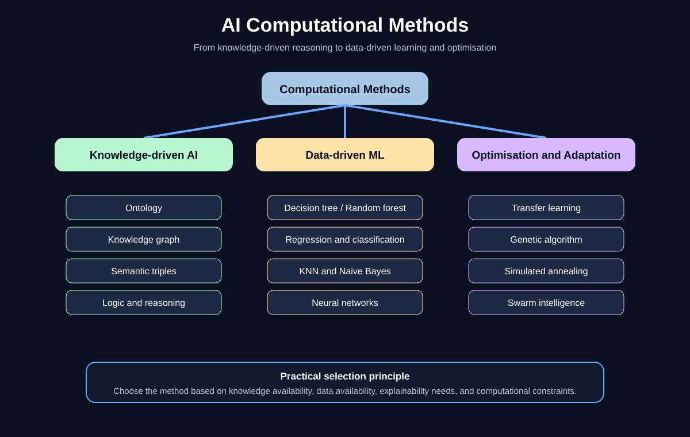

# AI Computational Methods

A practical Python-based taxonomy and implementation guide for major computational methods used in AI systems.

The repository covers knowledge-driven reasoning, traditional machine learning, neural-network architectures, transfer learning, and metaheuristic optimisation. It now includes runnable numerical examples, inspectable datasets, intermediate calculations, predictions, metrics, and algorithm data flows.

## Visual overview



## Run every numerical example

```bash
git clone https://github.com/nad-58/ai-computational-methods.git
cd ai-computational-methods
python -m venv .venv
source .venv/bin/activate  # Windows: .venv\Scripts\activate
pip install -r requirements.txt
PYTHONPATH=src python examples/numerical_all_methods_demo.py
```

Full worked tutorial:

[`docs/numerical-examples.md`](docs/numerical-examples.md)

Run the tests:

```bash
PYTHONPATH=src pytest -q
```

## Numerical coverage

| Family | Numerical methods |
|---|---|
| Knowledge-driven AI | Ontology inheritance, instance inference, knowledge-graph query, derived numerical indicator |
| Logic and reasoning | Modus ponens, modus tollens, transitive inference, induction, hypothesis testing, Bayes rule |
| Traditional ML | Decision tree, random forest, linear regression, logistic regression, KNN, Gaussian Naive Bayes |
| Neural networks | Feedforward, RNN, LSTM, CNN, GAN, BERT-style attention, XLNet-style permutation modelling |
| Transfer learning | Reused standardisation and PCA representation with target classifier |
| Metaheuristics | Genetic algorithm, evolution strategy, simulated annealing, particle swarm optimisation |

The unified runner reports sample counts, feature dimensions, train/test splits, intermediate values, predictions, metrics, final solutions, and a clear flow description for every method.

## Example datasets

| File | Size | Purpose |
|---|---:|---|
| [`data/numerical_classification_dataset.csv`](data/numerical_classification_dataset.csv) | 24 rows, 4 features | Classification |
| [`data/regression_example.csv`](data/regression_example.csv) | 12 rows, 3 features | Regression |
| [`data/sequence_example.csv`](data/sequence_example.csv) | 4 time steps | RNN sequence |
| [`data/image_matrix_example.csv`](data/image_matrix_example.csv) | 4 by 4 matrix | CNN convolution |
| [`data/token_embeddings_example.csv`](data/token_embeddings_example.csv) | 3 tokens, 2 dimensions | Self-attention |

The runnable examples use fixed random seed `7` for reproducibility.

## Numerical implementation files

```text
src/ai_computational_approaches/numerical_symbolic.py
src/ai_computational_approaches/numerical_ml.py
src/ai_computational_approaches/numerical_neural.py
src/ai_computational_approaches/numerical_transfer_optimisation.py
examples/numerical_all_methods_demo.py
tests/test_numerical_examples.py
docs/numerical-examples.md
```

## Existing example commands

```bash
PYTHONPATH=src python examples/run_all.py
PYTHONPATH=src python examples/knowledge_driven_demo.py
PYTHONPATH=src python examples/logic_reasoning_demo.py
PYTHONPATH=src python examples/standard_ml_demo.py
PYTHONPATH=src python examples/neural_network_demo.py
PYTHONPATH=src python examples/transfer_learning_demo.py
PYTHONPATH=src python examples/metaheuristics_demo.py
```

## Diagrams

| Diagram | Purpose |
|---|---|
| [`docs/images/ai-taxonomy-overview.svg`](docs/images/ai-taxonomy-overview.svg) | Overall method taxonomy |
| [`docs/images/knowledge-vs-data-driven.svg`](docs/images/knowledge-vs-data-driven.svg) | Knowledge-driven versus data-driven AI |
| [`docs/images/neural-network-family.svg`](docs/images/neural-network-family.svg) | Neural-network families |
| [`docs/images/bert-vs-xlnet.svg`](docs/images/bert-vs-xlnet.svg) | Contextual language-model comparison |
| [`docs/images/genetic-algorithm-cycle.svg`](docs/images/genetic-algorithm-cycle.svg) | Metaheuristic optimisation cycle |

## Disclaimer

This is an educational and professional portfolio repository. The examples are simplified and synthetic. Production AI systems require representative data, independent validation, robustness testing, monitoring, security review, privacy assessment, and responsible AI governance.
