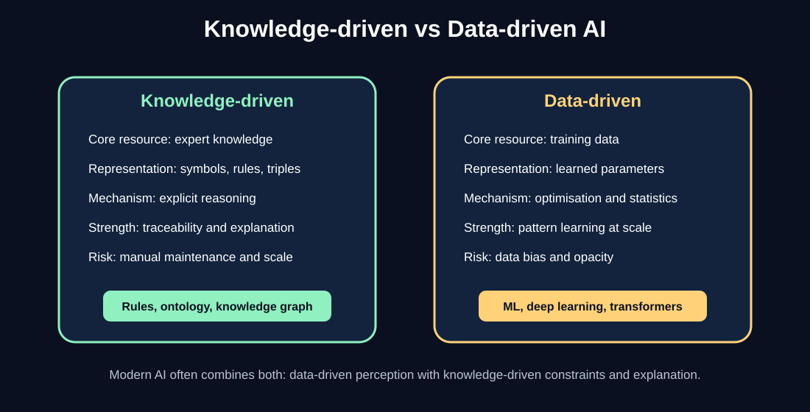
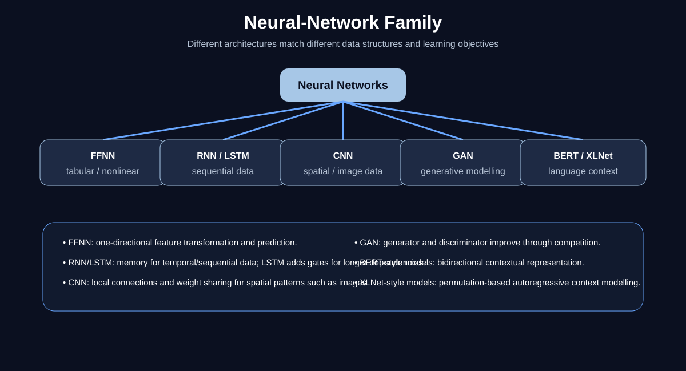
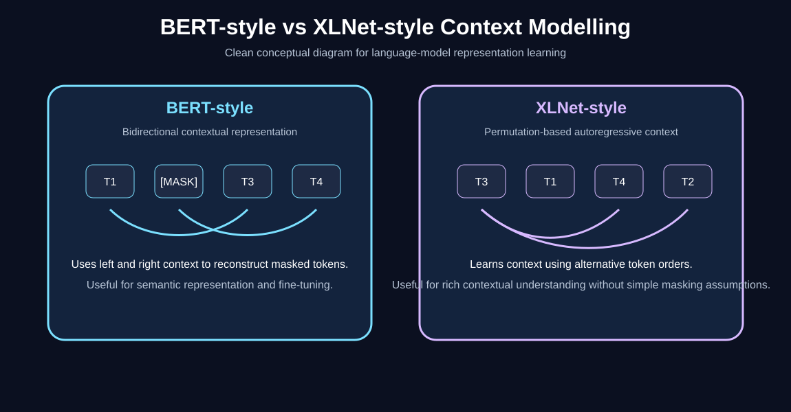

# Diagrams and Visual Guide

This page collects the clean original diagrams used in the repository.

These diagrams are public-safe, simplified, and created for this repository. They are not copied from training slides, standards, or organisation-specific course material.

## Available diagrams

| Diagram | File | Purpose |
|---|---|---|
| AI taxonomy overview | [`images/ai-taxonomy-overview.svg`](images/ai-taxonomy-overview.svg) | Overall map of AI computational methods |
| Knowledge-driven vs data-driven AI | [`images/knowledge-vs-data-driven.svg`](images/knowledge-vs-data-driven.svg) | Comparison between symbolic/rule-based and data-driven approaches |
| Neural-network family | [`images/neural-network-family.svg`](images/neural-network-family.svg) | Overview of FFNN, RNN, LSTM, CNN, GAN, BERT-style and XLNet-style models |
| BERT-style vs XLNet-style modelling | [`images/bert-vs-xlnet.svg`](images/bert-vs-xlnet.svg) | Conceptual comparison of two language-modelling approaches |
| Genetic algorithm cycle | [`images/genetic-algorithm-cycle.svg`](images/genetic-algorithm-cycle.svg) | Population-based optimisation workflow |

## Preview

### AI taxonomy overview

### Knowledge-driven vs data-driven AI

### Neural-network family

### BERT-style vs XLNet-style modelling

### Genetic algorithm cycle

