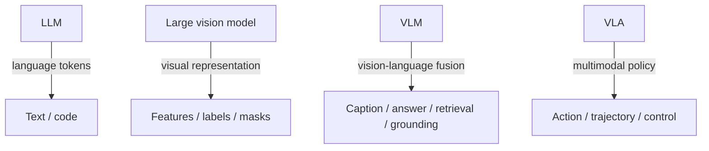

# LLM, Large Vision Model, VLM, and VLA

These model families are related but not interchangeable.

## Comparison

| Family | Typical input | Typical output | Main purpose |
|---|---|---|---|
| Large language model (LLM) | Text or tokens | Text, code, structured tokens | Language modelling and generation |
| Large vision model | Images or video | Visual embeddings, classes, boxes, masks, depth, features | General visual representation and perception |
| Vision-language model (VLM) | Images/video plus text | Captions, answers, similarity scores, retrieved items, visual regions | Cross-modal alignment and visual-language reasoning |
| Vision-language-action model (VLA) | Vision, language, state/history | Actions, trajectories, control tokens, policies | Embodied instruction following and control |

## Important terminology note

The acronym **LVM** is ambiguous. It can mean “large vision model” in some sources and “large vision-language model” in others. This repository writes out **large vision model** and reserves **VLM** for vision-language model.

## Architectural boundaries

### LLM

An LLM is trained primarily over language or token sequences. It may be used for generation, classification, extraction, reasoning, or tool planning. It does not become a VLM unless visual information is explicitly encoded and connected to the language model.

### Large vision model

A large vision model is a vision-only or vision-first foundation model. DINOv2 is an example of a model trained to produce transferable visual features. Segment Anything is a broadly pretrained visual model for promptable segmentation. These models can be very large without processing natural-language questions.

### VLM

A VLM learns relationships between vision and language. CLIP aligns image and text embeddings. Flamingo and LLaVA-style systems combine visual encoders with language generation. Both are VLMs, but their architectures and outputs differ.

### VLA

A VLA connects visual and language understanding to an action policy. OpenVLA combines language and visual components and is trained on robot demonstrations to produce control actions. The action interface creates additional temporal, physical, and safety constraints.

## Computational consequences

| Property | LLM | Large vision model | VLM | VLA |
|---|---|---|---|---|
| Token sequence modelling | Central | Optional | Usually central in language component | Usually central in instruction component |
| Visual encoder | No | Central | Central | Central |
| Cross-modal alignment | No | No | Central | Central |
| Action decoder or policy | No | No | Usually no | Central |
| Physical environment interaction | No | No | Usually no | Yes |

## Why this matters

A method taxonomy should classify models by actual inputs, representations, and outputs rather than by marketing labels or parameter count. The same transformer architecture can appear in all four families, but its role differs:

- text transformer in an LLM;
- vision transformer in a vision model;
- multimodal fusion or language decoder in a VLM;
- policy or action-token decoder in a VLA.

## References

- IBM, “What are vision language models?”: https://www.ibm.com/think/topics/vision-language-models
- Arpita Pal, “LLM, VLM, and VLA”: https://medium.com/@arpipal2/llm-vlm-and-vla-d758b91479eb
- DINOv2: https://arxiv.org/abs/2304.07193
- CLIP: https://arxiv.org/abs/2103.00020
- Flamingo: https://arxiv.org/abs/2204.14198
- OpenVLA: https://arxiv.org/abs/2406.09246
